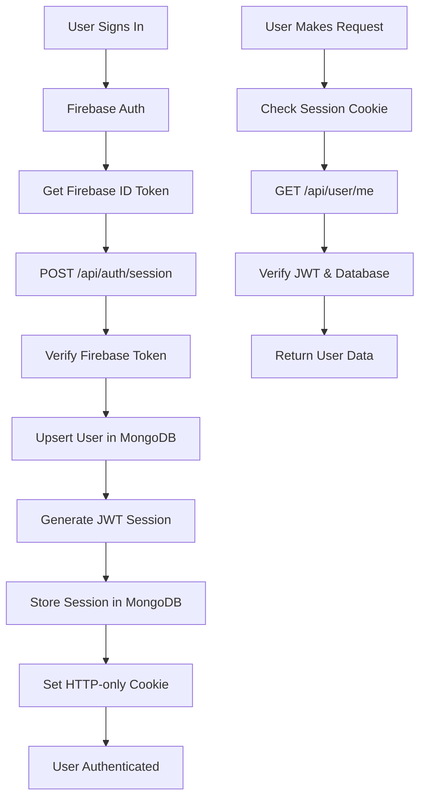

# 🔐 Firebase Auth App - API Documentation

This document provides a comprehensive overview of all API endpoints in the Firebase Authentication application, their purposes, database interactions, and usage throughout the codebase.

## 📋 Table of Contents

- [Overview](#overview)
- [Authentication Flow](#authentication-flow)
- [API Endpoints](#api-endpoints)
  - [POST /api/auth/session](#post-apiauthsession)
  - [POST /api/auth/refresh-session](#post-apiauthrefresh-session)
  - [GET /api/user/me](#get-apiuserme)
  - [POST /api/auth/logout](#post-apiauthlogout)
- [Database Interactions](#database-interactions)
- [Security Features](#security-features)
- [Usage in Frontend](#usage-in-frontend)
- [Error Handling](#error-handling)

## 🎯 Overview

This application implements a hybrid authentication system that combines:
- **Firebase Authentication** for primary authentication
- **MongoDB** for user data persistence and session management
- **JWT tokens** for secure server-side sessions
- **HTTP-only cookies** for client-side session storage

## 🔄 Authentication Flow



## 🚀 API Endpoints

### POST /api/auth/session

**Purpose**: Creates a new server-side session after Firebase authentication

**Location**: `app/api/auth/session/route.ts`

**Request Body**:
```json
{
  "idToken": "firebase_id_token_string"
}
```

**Response**:
```json
{
  "success": true,
  "user": {
    "uid": "user_uid",
    "email": "user@example.com",
    "name": "User Name",
    "provider": "google|github|email",
    "photoURL": "https://..."
  }
}
```

**What it does**:
1. **Validates Firebase ID Token** using Firebase Admin SDK
2. **Extracts user data** from the decoded token
3. **Upserts user** in MongoDB (creates or updates user record)
4. **Generates JWT session token** with user data and session ID
5. **Stores hashed session** in MongoDB with expiration
6. **Sets HTTP-only cookie** with the JWT token
7. **Returns user data** to the client

**Database Interactions**:
- **UserService.upsertUser()** - Creates/updates user record
- **UserService.addUserSession()** - Stores session with bcrypt hashing
- **User model** - MongoDB document with user data and sessions array

**Used in**:
- `lib/firebase/auth.ts` - `createSession()` function
- Called after successful Firebase authentication

---

### POST /api/auth/refresh-session

**Purpose**: Refreshes an existing session with a new Firebase ID token

**Location**: `app/api/auth/refresh-session/route.ts`

**Request Body**:
```json
{
  "idToken": "new_firebase_id_token_string"
}
```

**Response**:
```json
{
  "success": true,
  "user": {
    "uid": "user_uid",
    "email": "user@example.com",
    "name": "User Name",
    "provider": "google|github|email",
    "photoURL": "https://..."
  }
}
```

**What it does**:
1. **Verifies new Firebase ID token**
2. **Removes old session** from database if exists
3. **Generates new session** with updated token
4. **Updates session in database** with new expiration
5. **Sets new HTTP-only cookie**
6. **Returns updated user data**

**Database Interactions**:
- **UserService.removeUserSession()** - Removes old session
- **UserService.addUserSession()** - Adds new session
- **UserService.findByUid()** - Gets updated user data

**Used in**:
- Session refresh scenarios
- Token renewal processes

---

### GET /api/user/me

**Purpose**: Retrieves current user information from session

**Location**: `app/api/user/me/route.ts`

**Authentication**: 
- HTTP-only cookie (`app_session`)
- OR Authorization header with Firebase ID token

**Response**:
```json
{
  "success": true,
  "user": {
    "uid": "user_uid",
    "email": "user@example.com",
    "name": "User Name",
    "provider": "google|github|email",
    "photoURL": "https://...",
    "lastSeen": "2024-01-01T00:00:00.000Z"
  },
  "source": "database|firebase"
}
```

**What it does**:
1. **Checks for Firebase ID token** in Authorization header
2. **Falls back to session cookie** if no token
3. **Verifies JWT session** and validates in database
4. **Returns user data** from MongoDB
5. **Updates lastSeen** timestamp

**Database Interactions**:
- **UserService.findByUid()** - Retrieves user from database
- **UserService.validateUserSession()** - Validates session exists
- **User model** - Updates lastSeen field

**Used in**:
- User profile pages
- Authentication state checks
- User data display

---

### POST /api/auth/logout

**Purpose**: Logs out user and clears server-side session

**Location**: `app/api/auth/logout/route.ts`

**Authentication**: HTTP-only cookie (`app_session`)

**Response**:
```json
{
  "success": true,
  "message": "Logged out successfully"
}
```

**What it does**:
1. **Verifies session cookie** and extracts user ID
2. **Removes session** from MongoDB database
3. **Clears HTTP-only cookie** (sets to empty with maxAge: 0)
4. **Returns success response**

**Database Interactions**:
- **UserService.removeUserSession()** - Removes session from database
- **User model** - Updates sessions array

**Used in**:
- `lib/firebase/auth.ts` - `logout()` function
- Called when user signs out

---

## 🗄️ Database Interactions

### User Model Structure

```typescript
interface User {
  uid: string                    // Firebase UID (unique)
  email: string                  // User email (unique, lowercase)
  name?: string                  // Display name
  provider: "email" | "google" | "github"
  photoURL?: string              // Profile picture URL
  createdAt: Date               // Account creation date
  lastSeen: Date                // Last activity timestamp
  sessions: SessionRecord[]     // Array of active sessions
}

interface SessionRecord {
  tokenHash: string             // Bcrypt hashed JWT token
  issuedAt: Date               // Session creation time
  expiresAt: Date              // Session expiration time
  userAgent?: string           // Browser/client info
  ip?: string                  // Client IP address
}
```

### Database Operations

**UserService Methods**:
- `findByUid(uid)` - Find user by Firebase UID
- `findByEmail(email)` - Find user by email
- `upsertUser(userData)` - Create or update user
- `addUserSession(uid, token, expires, userAgent, ip)` - Add new session
- `removeUserSession(uid, token)` - Remove specific session
- `validateUserSession(uid, token)` - Validate session exists
- `cleanExpiredSessions(uid)` - Remove expired sessions

**Security Features**:
- **Bcrypt hashing** for session tokens
- **Automatic session cleanup** on new login
- **IP and User-Agent tracking** for security
- **Session expiration** (7 days default)

---

## 🔒 Security Features

### JWT Token Structure
```typescript
interface JWTPayload {
  uid: string
  email: string
  name?: string
  provider?: string
  photoURL?: string
  sessionId: string
  iat: number    // Issued at
  exp: number    // Expires at
}
```

### Security Measures
1. **HTTP-only cookies** - Prevents XSS attacks
2. **Secure flag** - HTTPS only in production
3. **SameSite: lax** - CSRF protection
4. **Bcrypt hashing** - Session tokens are hashed in database
5. **Firebase verification** - Server-side token validation
6. **Session expiration** - Automatic cleanup of expired sessions
7. **IP tracking** - Monitor session locations

---

## 🎨 Usage in Frontend

### Authentication Hook
```typescript
// hooks/use-auth.tsx
const { user, loading, signOut } = useAuth()
```

### Session Creation
```typescript
// lib/firebase/auth.ts
export async function createSession(idToken: string) {
  const response = await fetch("/api/auth/session", {
    method: "POST",
    headers: { "Content-Type": "application/json" },
    body: JSON.stringify({ idToken }),
  })
  return await response.json()
}
```

### Logout Process
```typescript
// lib/firebase/auth.ts
export async function logout() {
  // Clear server session
  await fetch("/api/auth/logout", { method: "POST" })
  // Sign out from Firebase
  await signOutUser()
}
```

### Protected Routes
```typescript
// components/auth/protected-route.tsx
<AuthRequiredRoute>
  <AboutMePageContent />
</AuthRequiredRoute>
```

---

## ⚠️ Error Handling

### Common Error Responses

**401 Unauthorized**:
```json
{
  "success": false,
  "error": "Invalid session",
  "details": "Session expired or invalid"
}
```

**400 Bad Request**:
```json
{
  "success": false,
  "error": "Invalid request data",
  "details": [/* Zod validation errors */]
}
```

**404 Not Found**:
```json
{
  "success": false,
  "error": "User not found"
}
```

**500 Internal Server Error**:
```json
{
  "success": false,
  "error": "Internal server error"
}
```

### Error Handling Strategy
1. **Input validation** using Zod schemas
2. **Firebase token verification** with fallback
3. **Database error handling** with graceful degradation
4. **Consistent error response format**
5. **Logging** for debugging and monitoring

---

## 🔧 Configuration

### Environment Variables
```bash
# Firebase Configuration
NEXT_PUBLIC_FIREBASE_API_KEY=your_api_key
NEXT_PUBLIC_FIREBASE_AUTH_DOMAIN=your_domain
NEXT_PUBLIC_FIREBASE_PROJECT_ID=your_project_id
FIREBASE_SERVICE_ACCOUNT_KEY={"type":"service_account",...}

# JWT Configuration
JWT_SECRET=your_jwt_secret_32_chars_min

# Database
MONGODB_URI=mongodb://localhost:27017/firebase-auth-app
```

### Middleware Configuration
```typescript
// middleware.ts
export const config = {
  matcher: [
    "/((?!api|_next/static|_next/image|favicon.ico|public).*)",
  ],
}
```

---

## 📊 Monitoring & Analytics

### User Statistics
The `UserService.getUserStats()` method provides:
- **Total users** count
- **Active users** (last 30 days)
- **Users by provider** (email, Google, GitHub)

### Session Tracking
- **Session creation** timestamps
- **User agent** information
- **IP address** tracking
- **Last seen** updates

---

## 🚀 Deployment Considerations

### Production Settings
- **Secure cookies** enabled
- **HTTPS required** for secure flag
- **Environment validation** enabled
- **Error logging** configured
- **Database connection pooling**

### Performance Optimizations
- **Connection reuse** for MongoDB
- **JWT caching** for verification
- **Session cleanup** background jobs
- **Database indexing** on uid and email

---

This API documentation provides a complete understanding of the authentication system, its security measures, and how it integrates with Firebase and MongoDB to provide a robust, scalable authentication solution.
