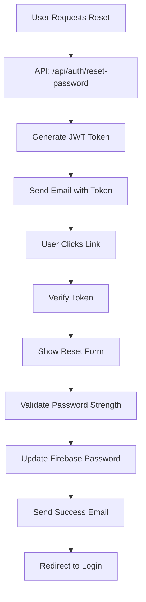

# 🔐 Custom Password Reset System

This document explains the custom password reset system implementation that replaces Firebase's default reset flow with a more secure, customizable solution.

## 🎯 Overview

The custom password reset system provides:
- **JWT-based tokens** for secure password reset links
- **Custom email templates** with beautiful HTML design
- **Password strength validation** with real-time feedback
- **Enhanced security** with token expiration and validation
- **Better UX** with custom pages and animations
- **Full control** over the reset process

## 🏗️ Architecture



## 📁 File Structure

```
lib/services/
├── email-service.ts          # Email sending functionality
└── reset-token-service.ts    # JWT token management

app/api/auth/reset-password/
└── route.ts                  # API endpoints

app/auth/reset-password/
├── page.tsx                  # Reset request form
└── confirm/page.tsx          # Password reset confirmation

components/auth/
├── reset-password-form.tsx   # Updated form component
└── password-strength.tsx     # Password validation component
```

## 🔧 API Endpoints

### POST `/api/auth/reset-password`
**Purpose**: Request password reset email

**Request Body**:
```json
{
  "email": "user@example.com"
}
```

**Response**:
```json
{
  "success": true,
  "message": "Password reset email sent successfully"
}
```

### PUT `/api/auth/reset-password`
**Purpose**: Confirm password reset with token

**Request Body**:
```json
{
  "token": "jwt_token_here",
  "password": "new_password",
  "confirmPassword": "new_password"
}
```

**Response**:
```json
{
  "success": true,
  "message": "Password reset successfully"
}
```

### GET `/api/auth/reset-password/verify?token=jwt_token`
**Purpose**: Verify reset token validity

**Response**:
```json
{
  "success": true,
  "user": {
    "email": "user@example.com",
    "name": "User Name"
  }
}
```

## 🔐 Security Features

### JWT Token Security
- **1-hour expiration** for reset tokens
- **User-specific tokens** tied to user ID and email
- **Type validation** ensures tokens are only for password reset
- **Secure signing** with JWT secret

### Password Validation
- **Minimum 6 characters** (configurable)
- **Real-time strength indicator**
- **Character requirements** (uppercase, lowercase, numbers, special chars)
- **Password confirmation** matching

### Rate Limiting
- **Attempt tracking** to prevent abuse
- **User feedback** for multiple attempts
- **Server-side validation** of all requests

## 📧 Email System

### Email Templates
- **Responsive HTML design** that works on all devices
- **Brand-consistent styling** with gradient colors
- **Clear call-to-action buttons**
- **Security warnings** and instructions
- **Fallback text version** for email clients

### Email Providers Supported
- **Gmail** (with app passwords)
- **SendGrid**
- **Mailgun**
- **AWS SES**
- **Any SMTP provider**

## 🎨 User Experience

### Reset Request Flow
1. User enters email address
2. Form validates email format
3. API checks if user exists
4. JWT token generated and sent via email
5. Success message with instructions

### Reset Confirmation Flow
1. User clicks link in email
2. Token verified for validity and expiration
3. Custom reset form displayed
4. Real-time password strength validation
5. Password confirmation matching
6. Firebase password updated
7. Success email sent
8. Redirect to login page

### Visual Feedback
- **Loading states** with spinners
- **Success animations** with checkmarks
- **Error states** with clear messages
- **Progress indicators** for multi-step processes
- **Smooth transitions** with Framer Motion

## 🔧 Configuration

### Environment Variables
```bash
# Email Configuration
EMAIL_HOST=smtp.gmail.com
EMAIL_PORT=587
EMAIL_USER=your_email@gmail.com
EMAIL_PASS=your_app_password
EMAIL_FROM_NAME=Firebase Auth App

# JWT Secret (already configured)
JWT_SECRET=your-super-secret-jwt-key

# App URL
NEXT_PUBLIC_APP_URL=http://localhost:3000
```

### Email Setup
1. **Enable 2FA** on your email account
2. **Generate app password** for SMTP access
3. **Configure SMTP settings** in environment variables
4. **Test email delivery** with provided test script

## 🚀 Usage Examples

### Frontend Integration
```typescript
// Request password reset
const response = await fetch('/api/auth/reset-password', {
  method: 'POST',
  headers: { 'Content-Type': 'application/json' },
  body: JSON.stringify({ email: 'user@example.com' })
});

// Confirm password reset
const response = await fetch('/api/auth/reset-password', {
  method: 'PUT',
  headers: { 'Content-Type': 'application/json' },
  body: JSON.stringify({
    token: 'jwt_token_here',
    password: 'new_password',
    confirmPassword: 'new_password'
  })
});
```

### Backend Integration
```typescript
import { ResetTokenService } from '@/lib/services/reset-token-service';

// Create reset request
const result = await ResetTokenService.createResetRequest('user@example.com');

// Reset password with token
const result = await ResetTokenService.resetPasswordWithToken(token, newPassword);
```

## 🧪 Testing

### Manual Testing
1. **Request reset** with valid email
2. **Check email** for reset link
3. **Click link** to verify token
4. **Enter new password** with strength validation
5. **Confirm reset** and check success email
6. **Login** with new password

### API Testing
```bash
# Request reset
curl -X POST http://localhost:3000/api/auth/reset-password \
  -H "Content-Type: application/json" \
  -d '{"email":"test@example.com"}'

# Verify token
curl "http://localhost:3000/api/auth/reset-password/verify?token=your_token"

# Confirm reset
curl -X PUT http://localhost:3000/api/auth/reset-password \
  -H "Content-Type: application/json" \
  -d '{"token":"your_token","password":"newpass","confirmPassword":"newpass"}'
```

## 🔍 Error Handling

### Common Errors
- **Invalid email format** - Client-side validation
- **User not found** - Server-side validation
- **Invalid/expired token** - JWT verification
- **Weak password** - Password strength validation
- **Email delivery failure** - SMTP error handling

### Error Messages
- **User-friendly messages** for all error cases
- **Toast notifications** for immediate feedback
- **Form validation** with inline error display
- **Fallback pages** for invalid links

## 🚀 Deployment Considerations

### Production Setup
1. **Use production email service** (SendGrid, Mailgun, etc.)
2. **Configure proper SMTP settings**
3. **Set up email monitoring** and alerts
4. **Test email delivery** in production environment
5. **Monitor reset request rates** for abuse detection

### Security Checklist
- [ ] JWT secret is properly configured
- [ ] Email credentials are secure
- [ ] Rate limiting is implemented
- [ ] Token expiration is appropriate
- [ ] HTTPS is enforced for all requests
- [ ] Email templates don't expose sensitive data

## 📊 Monitoring

### Key Metrics
- **Reset request success rate**
- **Email delivery rate**
- **Token validation success rate**
- **Password reset completion rate**
- **Error rates by type**

### Logging
- **All reset requests** logged with timestamps
- **Token generation** and validation events
- **Email sending** success/failure
- **Password update** operations
- **Error details** for debugging

## 🔄 Migration from Firebase Default

### Benefits of Custom System
1. **Full control** over reset process
2. **Custom branding** in emails
3. **Enhanced security** with JWT tokens
4. **Better UX** with custom pages
5. **Password strength validation**
6. **Detailed analytics** and monitoring
7. **Flexible email providers**

### Migration Steps
1. **Deploy custom system** alongside existing
2. **Test thoroughly** in staging environment
3. **Update frontend** to use new API
4. **Monitor performance** and error rates
5. **Remove old Firebase reset** code
6. **Update documentation** and user guides

This custom password reset system provides a robust, secure, and user-friendly alternative to Firebase's default reset flow while maintaining full control over the user experience and security measures.

