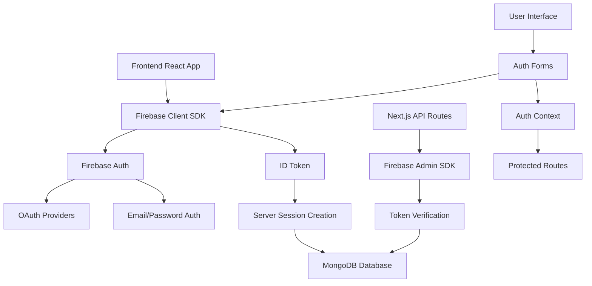
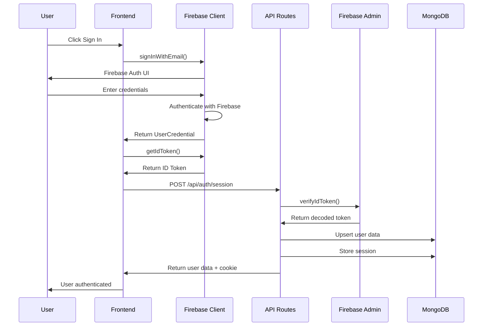

# 🔥 Firebase Integration Documentation

This document provides a comprehensive overview of Firebase integration in our Firebase Auth App, explaining every aspect of how Firebase is used, configured, and implemented throughout the project.

## 📋 Table of Contents

- [Firebase Overview](#firebase-overview)
- [Project Architecture](#project-architecture)
- [Firebase Configuration](#firebase-configuration)
- [Firebase Files Structure](#firebase-files-structure)
- [Authentication Flow](#authentication-flow)
- [Client-Side Firebase](#client-side-firebase)
- [Server-Side Firebase](#server-side-firebase)
- [OAuth Providers](#oauth-providers)
- [Environment Variables](#environment-variables)
- [Security Implementation](#security-implementation)
- [Error Handling](#error-handling)
- [Development vs Production](#development-vs-production)
- [Troubleshooting](#troubleshooting)

## 🔥 Firebase Overview

### What is Firebase?
Firebase is Google's mobile and web application development platform that provides backend services including:
- **Authentication** - User authentication and authorization
- **Firestore** - NoSQL cloud database
- **Storage** - Cloud file storage
- **Hosting** - Web hosting
- **Analytics** - User analytics and insights
- **Cloud Functions** - Serverless functions

### Why Firebase in Our Project?
Our project uses Firebase specifically for:
1. **Primary Authentication** - Email/password and OAuth providers
2. **User Management** - User registration, login, and profile management
3. **Token Generation** - Secure ID tokens for server-side verification
4. **OAuth Integration** - Google and GitHub authentication
5. **Fallback System** - Backup authentication when Firebase is unavailable

## 🏗️ Project Architecture



## ⚙️ Firebase Configuration

### Configuration Files

#### 1. `lib/firebase/config.ts` - Client Configuration
```typescript
// Firebase client-side configuration
const firebaseConfig = {
  apiKey: "your-api-key",
  authDomain: "your-project.firebaseapp.com",
  projectId: "your-project-id",
  storageBucket: "your-project.appspot.com",
  messagingSenderId: "123456789",
  appId: "1:123456789:web:abcdef123456",
  measurementId: "G-XXXXXXXXXX" // Optional for Analytics
}
```

**Purpose**: Initializes Firebase client SDK for browser usage
**Key Features**:
- ✅ **Singleton Pattern** - Prevents multiple Firebase instances
- ✅ **Environment Variables** - Secure configuration management
- ✅ **Development Fallback** - Demo config for development
- ✅ **Analytics Support** - Optional Google Analytics integration

#### 2. `lib/firebase/admin.ts` - Server Configuration
```typescript
// Firebase Admin SDK configuration
const adminApp = initializeApp({
  credential: cert(serviceAccount),
  projectId: "your-project-id"
})
```

**Purpose**: Initializes Firebase Admin SDK for server-side operations
**Key Features**:
- ✅ **Service Account** - Server-side authentication
- ✅ **Token Verification** - Verify client ID tokens
- ✅ **Admin Privileges** - Full Firebase access
- ✅ **Error Handling** - Graceful fallback for development

## 📁 Firebase Files Structure

### Directory: `lib/firebase/`

```
lib/firebase/
├── config.ts      # Client-side Firebase configuration
├── auth.ts        # Authentication functions and utilities
└── admin.ts       # Server-side Firebase Admin SDK
```

### File Breakdown

#### `config.ts` - Client Configuration
**Purpose**: Sets up Firebase client SDK for browser usage

**Key Functions**:
- `getFirebaseConfig()` - Retrieves and validates Firebase config
- `initializeApp()` - Initializes Firebase app instance
- `getAuth()` - Gets Firebase Auth instance

**Configuration Sources**:
1. **Environment Variables** - Primary source
2. **Demo Config** - Fallback for development
3. **Error Handling** - Graceful degradation

**Security Features**:
- ✅ **Public Variables** - Only safe-to-expose config
- ✅ **Validation** - Environment variable validation
- ✅ **Development Mode** - Safe demo configuration

#### `auth.ts` - Authentication Functions
**Purpose**: Provides authentication functions for the frontend

**Authentication Methods**:
- `signUpWithEmail()` - Email/password registration
- `signInWithEmail()` - Email/password login
- `signInWithGoogle()` - Google OAuth
- `signInWithGithub()` - GitHub OAuth
- `resetPassword()` - Password reset
- `signOutUser()` - User logout

**Utility Functions**:
- `formatAuthUser()` - Formats Firebase user data
- `onAuthStateChange()` - Auth state observer
- `getIdToken()` - Gets Firebase ID token
- `createSession()` - Creates server-side session
- `logout()` - Complete logout process

**OAuth Configuration**:
```typescript
// Google OAuth Provider
const googleProvider = new GoogleAuthProvider()
googleProvider.addScope("profile")
googleProvider.addScope("email")

// GitHub OAuth Provider
const githubProvider = new GithubAuthProvider()
githubProvider.addScope("user:email")
```

#### `admin.ts` - Server-Side Operations
**Purpose**: Handles server-side Firebase operations

**Key Functions**:
- `getAdminApp()` - Gets Firebase Admin app instance
- `verifyIdToken()` - Verifies client ID tokens
- `adminAuth` - Firebase Admin Auth instance

**Security Features**:
- ✅ **Service Account** - Secure server authentication
- ✅ **Token Verification** - Validates client tokens
- ✅ **Error Handling** - Graceful error management
- ✅ **Development Warnings** - Helpful development messages

## 🔐 Authentication Flow

### Complete Authentication Process



### Step-by-Step Breakdown

1. **User Interaction**:
   - User clicks sign in button
   - Form validation occurs
   - Credentials are submitted

2. **Firebase Authentication**:
   - `signInWithEmail()` called
   - Firebase validates credentials
   - UserCredential returned

3. **Token Generation**:
   - `getIdToken()` called
   - Firebase generates ID token
   - Token returned to frontend

4. **Server Session Creation**:
   - `createSession()` called
   - ID token sent to `/api/auth/session`
   - Server verifies token with Firebase Admin

5. **Database Operations**:
   - User data upserted in MongoDB
   - Session stored with bcrypt hashing
   - HTTP-only cookie set

6. **State Management**:
   - Auth context updated
   - User state propagated
   - Protected routes accessible

## 🖥️ Client-Side Firebase

### React Integration

#### Auth Context (`hooks/use-auth.tsx`)
```typescript
export function AuthProvider({ children }: { children: ReactNode }) {
  const [user, setUser] = useState<AuthUser | null>(null)
  const [loading, setLoading] = useState(true)

  useEffect(() => {
    const unsubscribe = onAuthStateChange(async (firebaseUser: User | null) => {
      if (firebaseUser) {
        // Process authenticated user
        const provider = firebaseUser.providerData[0]?.providerId || "email"
        const authUser = formatAuthUser(firebaseUser, provider)
        setUser(authUser)

        // Create server session
        const idToken = await getIdToken()
        if (idToken) {
          await createSession(idToken)
        }
      } else {
        setUser(null)
      }
      setLoading(false)
    })

    return unsubscribe
  }, [])
}
```

**Key Features**:
- ✅ **Real-time Updates** - Auth state changes automatically
- ✅ **Provider Detection** - Identifies OAuth provider
- ✅ **Session Creation** - Automatic server session creation
- ✅ **Error Handling** - Graceful error management

#### Auth Forms Integration

**Login Form** (`components/auth/login-form.tsx`):
```typescript
const onSubmit = async (data: LoginForm) => {
  setLoading(true)
  try {
    await signInWithEmail(data.email, data.password)
    toast({ title: "Welcome back!", description: "Successfully signed in." })
    router.push(redirectTo)
  } catch (error) {
    toast({ title: "Error", description: "Failed to sign in.", variant: "destructive" })
  } finally {
    setLoading(false)
  }
}
```

**Signup Form** (`components/auth/signup-form.tsx`):
```typescript
const onSubmit = async (data: SignupForm) => {
  setLoading(true)
  try {
    await signUpWithEmail(data.email, data.password)
    toast({ title: "Account created!", description: "Welcome to our app!" })
    router.push("/dashboard")
  } catch (error) {
    toast({ title: "Error", description: "Failed to create account.", variant: "destructive" })
  } finally {
    setLoading(false)
  }
}
```

### OAuth Integration

#### Google OAuth
```typescript
const handleGoogleSignIn = async () => {
  try {
    await signInWithGoogle()
    toast({ title: "Success", description: "Signed in with Google!" })
    router.push("/dashboard")
  } catch (error) {
    toast({ title: "Error", description: "Google sign-in failed.", variant: "destructive" })
  }
}
```

#### GitHub OAuth
```typescript
const handleGithubSignIn = async () => {
  try {
    await signInWithGithub()
    toast({ title: "Success", description: "Signed in with GitHub!" })
    router.push("/dashboard")
  } catch (error) {
    toast({ title: "Error", description: "GitHub sign-in failed.", variant: "destructive" })
  }
}
```

## 🖥️ Server-Side Firebase

### API Route Integration

#### Session Creation (`app/api/auth/session/route.ts`)
```typescript
export async function POST(request: NextRequest) {
  try {
    const { idToken } = await request.json()
    
    // Verify Firebase ID token
    const firebaseResult = await verifyIdToken(idToken)
    
    if (!firebaseResult.success) {
      return NextResponse.json({ success: false, error: "Invalid ID token" }, { status: 401 })
    }
    
    const { decodedToken } = firebaseResult
    
    // Process user data and create session
    // ... rest of the implementation
  } catch (error) {
    return NextResponse.json({ success: false, error: "Internal server error" }, { status: 500 })
  }
}
```

#### Token Verification (`lib/firebase/admin.ts`)
```typescript
export async function verifyIdToken(idToken: string) {
  try {
    const decodedToken = await adminAuth.verifyIdToken(idToken)
    return { success: true, decodedToken }
  } catch (error) {
    console.error("Firebase ID token verification failed:", error)
    return { success: false, error: error instanceof Error ? error.message : "Unknown error" }
  }
}
```

## 🔗 OAuth Providers

### Google OAuth Setup

#### 1. Google Cloud Console Configuration
```typescript
// OAuth 2.0 Client ID Configuration
{
  "client_id": "your-client-id.apps.googleusercontent.com",
  "client_secret": "your-client-secret",
  "redirect_uris": [
    "https://your-project.firebaseapp.com/__/auth/handler"
  ],
  "javascript_origins": [
    "http://localhost:3000",
    "https://your-domain.com"
  ]
}
```

#### 2. Firebase Console Configuration
- Go to Authentication > Sign-in method
- Enable Google provider
- Add OAuth client credentials
- Configure authorized domains

#### 3. Frontend Implementation
```typescript
// Google OAuth Provider Setup
const googleProvider = new GoogleAuthProvider()
googleProvider.addScope("profile")  // Access to profile information
googleProvider.addScope("email")    // Access to email address

// Sign in with Google
export async function signInWithGoogle(): Promise<UserCredential> {
  return signInWithPopup(auth, googleProvider)
}
```

### GitHub OAuth Setup

#### 1. GitHub OAuth App Configuration
```typescript
// GitHub OAuth App Settings
{
  "client_id": "your-github-client-id",
  "client_secret": "your-github-client-secret",
  "callback_url": "https://your-project.firebaseapp.com/__/auth/handler",
  "homepage_url": "http://localhost:3000"
}
```

#### 2. Firebase Console Configuration
- Go to Authentication > Sign-in method
- Enable GitHub provider
- Add OAuth client credentials
- Configure authorized domains

#### 3. Frontend Implementation
```typescript
// GitHub OAuth Provider Setup
const githubProvider = new GithubAuthProvider()
githubProvider.addScope("user:email")  // Access to user email

// Sign in with GitHub
export async function signInWithGithub(): Promise<UserCredential> {
  return signInWithPopup(auth, githubProvider)
}
```

## 🔧 Environment Variables

### Required Environment Variables

#### Client-Side (Public)
```bash
# Firebase Client Configuration
NEXT_PUBLIC_FIREBASE_API_KEY=AIzaSy...
NEXT_PUBLIC_FIREBASE_AUTH_DOMAIN=your-project.firebaseapp.com
NEXT_PUBLIC_FIREBASE_PROJECT_ID=your-project-id
NEXT_PUBLIC_FIREBASE_STORAGE_BUCKET=your-project.appspot.com
NEXT_PUBLIC_FIREBASE_MESSAGING_SENDER_ID=123456789
NEXT_PUBLIC_FIREBASE_APP_ID=1:123456789:web:abcdef123456
NEXT_PUBLIC_FIREBASE_MEASUREMENT_ID=G-XXXXXXXXXX  # Optional
```

#### Server-Side (Private)
```bash
# Firebase Admin Service Account
FIREBASE_SERVICE_ACCOUNT_KEY={"type":"service_account","project_id":"your-project",...}

# OAuth Provider Credentials
GOOGLE_CLIENT_ID=your-google-client-id.apps.googleusercontent.com
GOOGLE_CLIENT_SECRET=your-google-client-secret
GITHUB_CLIENT_ID=your-github-client-id
GITHUB_CLIENT_SECRET=your-github-client-secret
```

### Environment Validation (`lib/env.ts`)
```typescript
const envSchema = z.object({
  // Firebase Client Config (Public)
  NEXT_PUBLIC_FIREBASE_API_KEY: z.string().min(1, "Firebase API key is required"),
  NEXT_PUBLIC_FIREBASE_AUTH_DOMAIN: z.string().min(1, "Firebase auth domain is required"),
  NEXT_PUBLIC_FIREBASE_PROJECT_ID: z.string().min(1, "Firebase project ID is required"),
  NEXT_PUBLIC_FIREBASE_STORAGE_BUCKET: z.string().min(1, "Firebase storage bucket is required"),
  NEXT_PUBLIC_FIREBASE_MESSAGING_SENDER_ID: z.string().min(1, "Firebase messaging sender ID is required"),
  NEXT_PUBLIC_FIREBASE_APP_ID: z.string().min(1, "Firebase app ID is required"),
  NEXT_PUBLIC_FIREBASE_MEASUREMENT_ID: z.string().optional(),

  // Firebase Admin (Server-only)
  FIREBASE_SERVICE_ACCOUNT_KEY: z.string().min(1, "Firebase service account key is required"),
})
```

## 🛡️ Security Implementation

### Client-Side Security

#### 1. Environment Variable Protection
```typescript
// Only public variables are exposed
const config = {
  apiKey: env.NEXT_PUBLIC_FIREBASE_API_KEY,        // Safe to expose
  authDomain: env.NEXT_PUBLIC_FIREBASE_AUTH_DOMAIN, // Safe to expose
  // ... other public config
}
```

#### 2. OAuth Scope Management
```typescript
// Minimal required scopes
googleProvider.addScope("profile")  // Only profile info
googleProvider.addScope("email")    // Only email address
githubProvider.addScope("user:email") // Only user email
```

#### 3. Error Handling
```typescript
try {
  const result = await signInWithEmail(email, password)
  // Handle success
} catch (error) {
  console.error("Authentication error:", error)
  // Handle error gracefully
}
```

### Server-Side Security

#### 1. Token Verification
```typescript
export async function verifyIdToken(idToken: string) {
  try {
    const decodedToken = await adminAuth.verifyIdToken(idToken)
    return { success: true, decodedToken }
  } catch (error) {
    // Log error but don't expose details
    console.error("Firebase ID token verification failed:", error)
    return { success: false, error: "Token verification failed" }
  }
}
```

#### 2. Service Account Security
```typescript
// Service account key is parsed from environment
const serviceAccount = JSON.parse(env.FIREBASE_SERVICE_ACCOUNT_KEY)

// Initialize with proper credentials
const adminApp = initializeApp({
  credential: cert(serviceAccount),
  projectId: env.NEXT_PUBLIC_FIREBASE_PROJECT_ID,
})
```

## ⚠️ Error Handling

### Client-Side Error Handling

#### Authentication Errors
```typescript
try {
  await signInWithEmail(email, password)
} catch (error: any) {
  switch (error.code) {
    case 'auth/user-not-found':
      toast({ title: "Error", description: "No account found with this email." })
      break
    case 'auth/wrong-password':
      toast({ title: "Error", description: "Incorrect password." })
      break
    case 'auth/too-many-requests':
      toast({ title: "Error", description: "Too many failed attempts. Please try again later." })
      break
    default:
      toast({ title: "Error", description: "Authentication failed. Please try again." })
  }
}
```

#### OAuth Errors
```typescript
try {
  await signInWithGoogle()
} catch (error: any) {
  if (error.code === 'auth/popup-closed-by-user') {
    // User closed the popup - not an error
    return
  }
  toast({ title: "Error", description: "Google sign-in failed. Please try again." })
}
```

### Server-Side Error Handling

#### Token Verification Errors
```typescript
export async function verifyIdToken(idToken: string) {
  try {
    const decodedToken = await adminAuth.verifyIdToken(idToken)
    return { success: true, decodedToken }
  } catch (error) {
    console.error("Firebase ID token verification failed:", error)
    
    // Return generic error to client
    return { 
      success: false, 
      error: error instanceof Error ? error.message : "Token verification failed" 
    }
  }
}
```

## 🔄 Development vs Production

### Development Configuration

#### 1. Demo Configuration
```typescript
// Development fallback config
if (process.env.NODE_ENV === "development") {
  console.warn("Using demo Firebase config for development")
  return {
    apiKey: "demo-api-key",
    authDomain: "demo-project.firebaseapp.com",
    projectId: "demo-project",
    // ... other demo values
  }
}
```

#### 2. Firebase Emulator Support
```typescript
// Connect to Auth emulator in development
if (process.env.NODE_ENV === "development" && typeof window !== "undefined") {
  // Uncomment to use Firebase Auth emulator
  // connectAuthEmulator(auth, "http://localhost:9099")
}
```

#### 3. Development Warnings
```typescript
if (process.env.NODE_ENV === "development") {
  console.warn("Firebase Admin not configured properly for development")
  console.warn("Some server-side auth features may not work")
  console.warn("Please configure FIREBASE_SERVICE_ACCOUNT_KEY in .env.local")
}
```

### Production Configuration

#### 1. Environment Validation
```typescript
// Strict validation in production
if (process.env.NODE_ENV === "production") {
  throw new Error(`Environment validation failed:\n${missingVars}`)
}
```

#### 2. Secure Cookies
```typescript
// Production cookie settings
response.cookies.set("app_session", sessionToken, {
  httpOnly: true,
  secure: process.env.NODE_ENV === "production", // HTTPS only in production
  sameSite: "lax",
  maxAge: 7 * 24 * 60 * 60, // 7 days
  path: "/",
})
```

## 🐛 Troubleshooting

### Common Issues

#### 1. "Firebase configuration error"
**Cause**: Missing or invalid environment variables
**Solution**: 
- Check `.env.local` file exists
- Verify all required variables are set
- Ensure proper formatting of values

#### 2. "Firebase Admin initialization failed"
**Cause**: Invalid service account key
**Solution**:
- Verify `FIREBASE_SERVICE_ACCOUNT_KEY` is valid JSON
- Check service account has proper permissions
- Ensure project ID matches

#### 3. "OAuth provider not configured"
**Cause**: OAuth providers not enabled in Firebase Console
**Solution**:
- Go to Firebase Console > Authentication > Sign-in method
- Enable required providers (Google, GitHub)
- Configure OAuth credentials

#### 4. "Token verification failed"
**Cause**: Invalid or expired ID token
**Solution**:
- Check token is not expired
- Verify Firebase project configuration
- Ensure proper token format

### Debug Steps

#### 1. Check Environment Variables
```bash
# Verify environment variables are loaded
console.log(process.env.NEXT_PUBLIC_FIREBASE_PROJECT_ID)
```

#### 2. Test Firebase Connection
```typescript
// Test Firebase initialization
import { auth } from "@/lib/firebase/config"
console.log("Firebase Auth:", auth)
```

#### 3. Check Network Requests
- Open browser DevTools
- Go to Network tab
- Perform authentication actions
- Check for failed requests

#### 4. Verify OAuth Configuration
- Check Firebase Console settings
- Verify OAuth redirect URIs
- Test with different browsers

## 📊 Firebase Analytics (Optional)

### Google Analytics Integration

#### Configuration
```typescript
// Add measurement ID to config
if (env.NEXT_PUBLIC_FIREBASE_MEASUREMENT_ID) {
  config.measurementId = env.NEXT_PUBLIC_FIREBASE_MEASUREMENT_ID
}
```

#### Usage
```typescript
// Analytics will automatically track:
// - User authentication events
// - Page views
// - Custom events
// - User engagement metrics
```

## 🚀 Best Practices

### 1. Security
- ✅ Use environment variables for sensitive data
- ✅ Implement proper error handling
- ✅ Validate all inputs
- ✅ Use HTTPS in production

### 2. Performance
- ✅ Implement singleton pattern for Firebase instances
- ✅ Use proper loading states
- ✅ Handle authentication state efficiently
- ✅ Implement proper cleanup

### 3. User Experience
- ✅ Provide clear error messages
- ✅ Implement loading indicators
- ✅ Handle OAuth popup scenarios
- ✅ Provide fallback authentication

### 4. Development
- ✅ Use TypeScript for type safety
- ✅ Implement proper error boundaries
- ✅ Use development-friendly configurations
- ✅ Implement comprehensive logging

---

This documentation provides a complete understanding of Firebase integration in our project, from basic configuration to advanced security implementations. It serves as a reference for developers working with the authentication system and helps ensure proper Firebase usage throughout the application.
